<div align="center">
  

  <br/>

  <p>
    <a href="https://github.com/NexTechArchitect/Siso-Merkle-Airdrop">
      
    </a>
    
    
    
  </p>

  <p width="80%">
    <b>A production-grade architecture for distributing tokens efficiently.</b><br/>
    Secured by Merkle Proofs and EIP-712 Signatures to minimize on-chain costs.
  </p>

  <br/>

  <table>
    <tr>
      <td align="center"><a href="#-architectural-flow"><strong>🏗 Architecture</strong></a></td>
      <td align="center"><a href="#-vesting-schedule"><strong>⏳ Vesting</strong></a></td>
      <td align="center"><a href="#-security-mechanics"><strong>🔐 Security</strong></a></td>
      <td align="center"><a href="#-project-structure"><strong>📂 Structure</strong></a></td>
    </tr>
  </table>

</div>

---

## 🏗 Architectural Flow

The system splits logic between **Off-Chain Computation** (saving gas) and **On-Chain Verification** (security).

```mermaid
graph LR
    subgraph OFF [💻 Off-Chain Backend]
      Input[("📄 Input List")] -->|Hash| Gen{Merkle Script}
      Gen -->|Generate| Root[Merkle Root]
      Gen -->|Generate| Proofs[JSON Proofs]
    end

    subgraph ON [⛓️ On-Chain Contract]
      Root -.->|1. Deploy Root| Contract[Airdrop Contract]
      User((👤 User)) -->|2. Sign Request| Wallet[MetaMask]
      Wallet -->|3. Submit Proof| Contract
      Contract -->|4. Verify & Transfer| User
    end

    style OFF fill:#1a1a1a,stroke:#666,stroke-width:1px,color:#fff
    style ON fill:#0d1117,stroke:#00FF99,stroke-width:2px,color:#fff
    style Contract fill:#222,stroke:#007AFF,stroke-width:2px
    style Gen fill:#333,stroke:#FF9900,stroke-width:2px

```



---

## ⏳ Vesting Schedule

The distribution follows a strict **Phase 1 → Gap → Phase 2** timeline.

| Phase Logic | Timeline | Action | Status |
| --- | --- | --- | --- |
| **🟢 Phase 1** | `Deployment` → `30 Days` | **Claim 50%** (Instant) | Active |
| **🟡 Gap Period** | `30 Days` → `90 Days` | **Locked** (No Claims) | Holding |
| **🔵 Phase 2** | `90 Days` → `97 Days` | **Claim Remaining 50%** | Vesting |
| **🔴 Expiry** | `> 97 Days` | **Burn / Withdraw** | Closed |

> **Note:** If a user misses the claim window, the owner can withdraw the remaining tokens to prevent dust accumulation.

---

## 🔐 Security Mechanics

We use industry-standard patterns to prevent exploits.

<table width="100%">
<tr>
<td width="50%" valign="top">
<h3>🛡️ Cryptographic Proofs</h3>
<ul>
<li><b>Merkle Tree:</b> We store only the <code>Root Hash</code> on-chain. This makes verifying 10,000 users as cheap as verifying 1 user.</li>
<li><b>Verification:</b> <code>MerkleProof.verify()</code> ensures the user is part of the original snapshot.</li>
</ul>
</td>
<td width="50%" valign="top">
<h3>✍️ EIP-712 Signatures</h3>
<ul>
<li><b>Anti-Phishing:</b> Users sign a structured, readable message ("Claim Airdrop") instead of a blind hex string.</li>
<li><b>Replay Protection:</b> Signatures include the <code>ChainID</code> and <code>Contract Address</code>, so a signature from Testnet cannot be used on Mainnet.</li>
</ul>
</td>
</tr>
</table>

---

## 📂 Project Structure

A clean separation of concerns.

```bash
.
├── airdrop-data/          # 🧠 Backend Logic
│   ├── input.json         # Address List
│   ├── merkle.js          # Tree Generation Script
│   └── backend/           # Signing Utilities
├── src/                   # ⛓️ Smart Contracts
│   ├── SisoToken.sol      # ERC20 Asset
│   └── MerkleAirdrop.sol  # Distribution Logic
├── script/                # 🚀 DevOps
│   └── Deploy.s.sol       # Deployment Scripts
└── test/                  # 🧪 Foundry Tests

```

---

## 🚀 Quick Start

```bash
# 1. Install Dependencies
forge install
npm install

# 2. Generate Merkle Root
node airdrop-data/merkle.js

# 3. Deploy to Sepolia
make deploy ARGS="--network sepolia"

```

---

<div align="center">


<b>Protocol Engineered by NexTechArchitect</b>


<i>Smart Contract Security • Foundry • Cryptography</i>


<a href="https://github.com/NexTechArchitect">

</a>
&nbsp;&nbsp;
<a href="https://linkedin.com/in/amit-kumar-811a11277">

</a>
&nbsp;&nbsp;
<a href="https://x.com/itZ_AmiT0">

</a>

</div>

```

```
