<div align="center">
  

  <p>
    <a href="https://github.com/NexTechArchitect/Siso-Merkle-Airdrop">
      
    </a>
    
    
    
  </p>

  <p width="80%">
    <b>A gas-optimized protocol for large-scale token distribution.</b><br/>
    Leverages off-chain Merkle Tree generation and on-chain EIP-712 signature verification to reduce claim costs by ~40%.
  </p>

  <br/>

  <table>
    <tr>
      <td align="center"><a href="#-architectural-flow"><strong>🏗 Architecture</strong></a></td>
      <td align="center"><a href="#-vesting-timeline"><strong>⏳ Vesting Timeline</strong></a></td>
      <td align="center"><a href="#-security-mechanics"><strong>🔐 Security</strong></a></td>
      <td align="center"><a href="#-project-structure"><strong>📂 Structure</strong></a></td>
    </tr>
  </table>

</div>

---

## 🏗 Architectural Flow

The system uses a **Hybrid Off-Chain/On-Chain** model. We calculate eligibility off-chain to save gas, and verify proofs on-chain for security.

```mermaid
graph LR
    %% Backend Logic
    subgraph OFFCHAIN ["💻 Off-Chain Backend"]
        Input[("📄 Input List")] -->|1. Hash| Script{{"⚙️ Merkle Gen"}}
        Script -->|Output| Root[("🌳 Root")]
        Script -->|Output| Proofs[("🔐 Proofs")]
    end

    %% Interaction Logic
    subgraph ONCHAIN ["⛓️ On-Chain Layer"]
        Root -.->|2. Deploy| Contract["🏛️ Airdrop Contract"]
        User((👤 User)) -->|3. Sign Msg| Wallet["🦊 MetaMask"]
        
        Wallet -->|4. Call Claim| Contract
        Proofs -.->|Verify Path| Contract
        Contract -->|5. Transfer| User
    end

    %% Styling
    style OFFCHAIN fill:#1a1a1a,stroke:#666,stroke-width:1px,color:#fff
    style ONCHAIN fill:#0d1117,stroke:#00FF99,stroke-width:2px,color:#fff
    style Contract fill:#222,stroke:#007AFF,stroke-width:2px
    style Script fill:#333,stroke:#FF9900,stroke-width:2px

```



### 🧠 Engineering Decisions

| Problem | Our Solution |
| --- | --- |
| **High Gas Costs** | Storing 10k users on-chain is expensive. We store **1 Root Hash (32 bytes)** instead. |
| **Front-Running** | `EIP-712` typed signatures bind the claim request to a specific user and chain ID. |
| **Token Dumping** | A strict **Phased Vesting** schedule prevents immediate market saturation. |

---

## ⏳ Vesting Timeline

The distribution follows a **Time-Based Lifecycle** to protect the token economy.


### 🔍 Phase Breakdown

| Time Period | Phase Name | User Action |
| --- | --- | --- |
| **0 - 30 Days** | **Phase 1** | ✅ Claim first **50%** of tokens immediately. |
| **30 - 90 Days** | **Holding Gap** | ⏸️ **No claims allowed.** Encourages holding. |
| **90 - 97 Days** | **Phase 2** | ✅ Claim the **Remaining 50%**. |
| **> 97 Days** | **Closed** | ❌ Claims closed. Owner withdraws dust. |

---

## 🔐 Security Mechanics

We use industry-standard patterns to prevent exploits.

<table width="100%">
<tr>
<td width="50%" valign="top">
<h3>🛡️ Cryptographic Proofs</h3>
<ul>
<li><b>Merkle Tree:</b> Uses `Keccak256` hashing to ensure data integrity.</li>
<li><b>Verification:</b> `MerkleProof.verify()` checks inclusion without revealing the full tree.</li>
</ul>
</td>
<td width="50%" valign="top">
<h3>✍️ EIP-712 Signatures</h3>
<ul>
<li><b>Anti-Phishing:</b> Users sign a structured, readable message ("Claim Airdrop").</li>
<li><b>Replay Protection:</b> Signatures include `ChainID` and `Contract Address`.</li>
</ul>
</td>
</tr>
</table>

---

## 📂 Project Structure

A clean separation of concerns: **Data** (Off-chain) vs **Source** (On-chain).

```bash
.
├── airdrop-data/          # 🧠 Off-Chain Logic
│   ├── input.json         # Raw Whitelist (Address + Amount)
│   ├── merkle.js          # Node.js Script for Root Generation
│   └── backend/           # Signing Utilities
├── src/                   # ⛓️ Smart Contracts
│   ├── SisoToken.sol      # The ERC20 Asset
│   └── MerkleAirdrop.sol  # Distribution Logic
├── script/                # 🚀 DevOps
│   └── Deploy.s.sol       # Deployment Scripts
└── test/                  # 🧪 Foundry Test Suite

```

---

## 🚀 Quick Start

**Prerequisites:** `Foundry`, `Node.js`

```bash
# 1. Install Dependencies
forge install
npm install

# 2. Generate Merkle Root & Proofs
node airdrop-data/merkle.js

# 3. Test the Claims
forge test -vv

```

---

<div align="center">


<b>Protocol Engineered by NexTechArchitect</b>


<i>Smart Contract Security • Foundry • Cryptography</i>


<a href="https://github.com/NexTechArchitect">

</a>
&nbsp;&nbsp;
<a href="https://linkedin.com/in/amit-kumar-811a11277">

</a>
</div>

```

```
