<div align="center">

  <br />
  <h1 style="font-size: 3rem; margin-bottom: 0;">Merkle-712 Airdrop Protocol</h1>

  <p style="font-size: 1.1rem; color: #b298dc; max-width: 600px;">
    <strong>A gas-optimized, cryptographically secure token distribution system.</strong><br/>
    Combines off-chain Merkle Trees with on-chain EIP-712 Signature verification for O(1) claim costs.
  </p>

  <p>
    <a href="https://github.com/NexTechArchitect/Siso-Merkle-Airdrop">
      
    </a>
    &nbsp;
    <a href="https://github.com/NexTechArchitect/Siso-Merkle-Airdrop">
      
    </a>
    &nbsp;
    <a href="https://eips.ethereum.org/EIPS/eip-712">
      
    </a>
  </p>

  <br />

</div>

---

## 📑 Table of Contents

- [🧠 Executive Summary](#-executive-summary)
- [🏗 Architectural Flow](#-architectural-flow)
- [✍️ EIP-712 Signature Standards](#%EF%B8%8F-eip-712-signature-standards)
- [🔢 Merkle Tree Mathematics](#-merkle-tree-mathematics)
- [🛡 Security & Vesting Timeline](#-security--vesting-timeline)
- [📂 Project Structure](#-project-structure)

---

## 🧠 Executive Summary

This protocol solves the "Million User Problem" in token distribution. Sending tokens to 1 million users via a loop would cost millions of dollars in gas.

Instead, we use a **Pull-Based Architecture**:
1.  **Compression:** We compress 1 million user balances into a single **32-byte Merkle Root**.
2.  **Verification:** Users provide a cryptographic proof that they are part of that root.
3.  **Security:** We add an extra layer of **EIP-712 Signatures** to prevent "Front-Running Claims" where a bot steals a user's proof to claim tokens for themselves.

---

## 🏗 Architectural Flow

The system uses a **Hybrid Off-Chain/On-Chain** model. We calculate eligibility off-chain to save gas, and verify proofs on-chain for trustless execution.

```mermaid
graph LR
    %% Backend Logic
    subgraph OFFCHAIN ["💻 Off-Chain Backend"]
        Input[("📄 Whitelist")] -->|1. Hash & Sort| Script{{"⚙️ Merkle Engine"}}
        Script -->|Output| Root[("🌳 Merkle Root")]
        Script -->|Output| Proofs[("🔐 User Proofs")]
    end

    %% Interaction Logic
    subgraph ONCHAIN ["⛓️ On-Chain Layer"]
        Root -.->|2. Deploy| Contract["🏛️ Airdrop Contract"]
        User((👤 User)) -->|3. Sign Msg| Wallet["🦊 MetaMask"]
        
        Wallet -->|4. Call Claim| Contract
        Proofs -.->|Verify Path| Contract
        Contract -->|5. Transfer Token| User
    end

    style OFFCHAIN fill:#1a1a1a,stroke:#b298dc
    style ONCHAIN fill:#2d1b4e,stroke:#9d4edd,stroke-width:2px
    style Contract fill:#1a1a1a,stroke:#fff
    style Script fill:#1a1a1a,stroke:#fff

```



### 🧠 Engineering Decisions

| Problem | Solution Architecture |
| --- | --- |
| **Storage Cost** | Storing 10k users on-chain is prohibitive. We store **1 Root Hash (32 bytes)** instead. |
| **Front-Running** | `EIP-712` typed signatures bind the claim request to a specific `msg.sender` and `chainId`. |
| **Token Dumping** | A strict **Phased Vesting** schedule prevents immediate market saturation. |

---

## ✍️ EIP-712 Signature Standards

We implement strict **Typed Structured Data** hashing. This ensures users know exactly what they are signing, preventing phishing attacks.

### The Domain Separator

```solidity
struct EIP712Domain {
    string name;              // "SisoAirdrop"
    string version;           // "1.0.0"
    uint256 chainId;          // 11155111 (Sepolia)
    address verifyingContract;// Contract Address
}

```

### The Message Struct

```solidity
struct AirdropClaim {
    address account;
    uint256 amount;
}

```

> **Why?** This prevents **Replay Attacks**. A signature generated for the Sepolia Testnet cannot be re-used on Mainnet because the `chainId` inside the hash would be different.

---

## 🔢 Merkle Tree Mathematics

The Merkle Tree allows us to verify inclusion in a set of data without revealing the entire set.

### 🌳 Tree Structure

* **Leaves:** `Keccak256(address, amount)`
* **Nodes:** `Keccak256(Child_A, Child_B)`
* **Root:** The final hash at the top of the tree.

If a user wants to claim, they must provide a **Proof Path** (hashes of sibling nodes). The contract re-calculates the hash up the tree.

$$ \text{If } \text{CalculatedRoot} == \text{StoredRoot} \implies \text{Valid Claim} $$

---

## 🛡 Security & Vesting Timeline

The distribution follows a **Time-Based Lifecycle** to protect the token economy from immediate sell pressure.


### 🔍 Phase Breakdown

| Time Period | Phase Name | User Action |
| --- | --- | --- |
| **0 - 30 Days** | **Phase 1** | ✅ Claim first **50%** of tokens immediately. |
| **30 - 90 Days** | **Holding Gap** | ⏸️ **No claims allowed.** Encourages holding. |
| **90 - 97 Days** | **Phase 2** | ✅ Claim the **Remaining 50%**. |
| **> 97 Days** | **Closed** | ❌ Claims closed. Owner withdraws dust. |

---

## 📂 Project Structure

A clean separation of concerns: **Data** (Off-chain generation) vs **Source** (On-chain execution).

```text
Siso-Merkle-Airdrop/
├── airdrop-data/          # 🧠 Off-Chain Logic
│   ├── input.json         # Raw Whitelist (Address + Amount)
│   ├── merkle.js          # Node.js Script for Root Generation
│   └── backend/           # EIP-712 Signing Utilities
├── src/                   # ⛓️ Smart Contracts
│   ├── SisoToken.sol      # The ERC20 Asset
│   └── MerkleAirdrop.sol  # Distribution Logic
├── script/                # 🚀 DevOps
│   └── Deploy.s.sol       # Deployment Scripts
└── test/                  # 🧪 Foundry Test Suite

```

---

<div align="center">


<b>Engineered by NEXTECHARHITECT</b>


<i>Smart Contract Developer · Solidity · Foundry · Web3 Engineering</i>


<a href="https://github.com/NexTechArchitect">GitHub</a> •
<a href="https://www.google.com/search?q=https://twitter.com/NexTechArchitect">Twitter</a>
</div>

```

```
